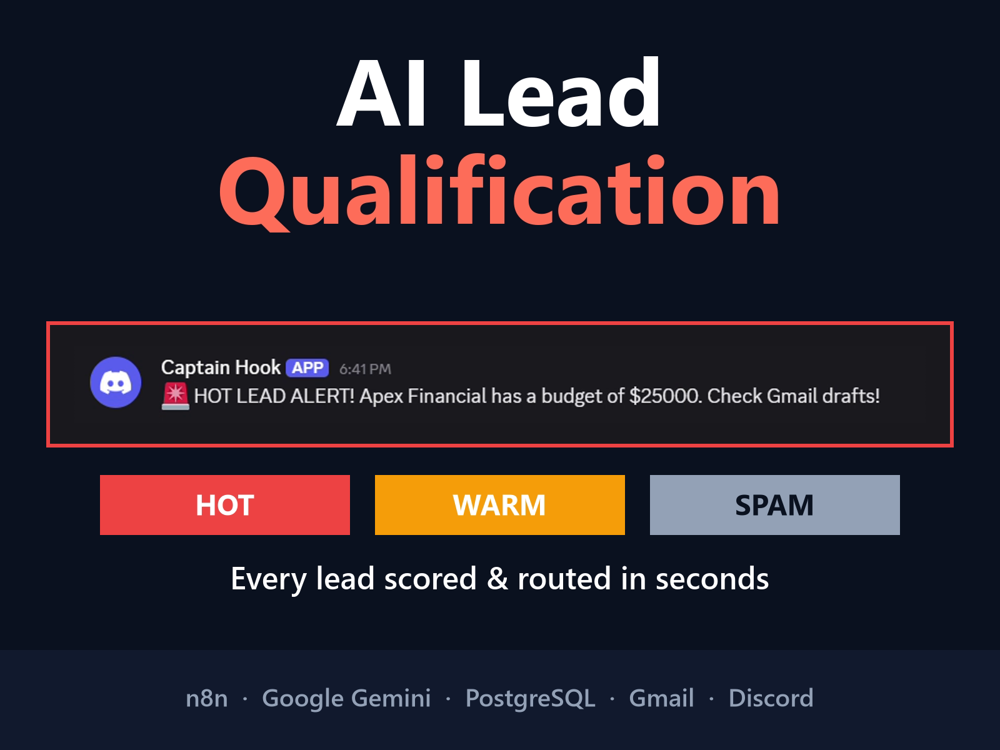
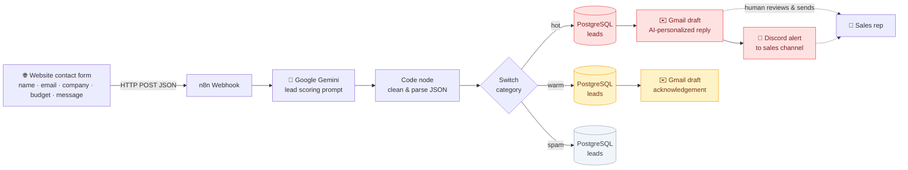
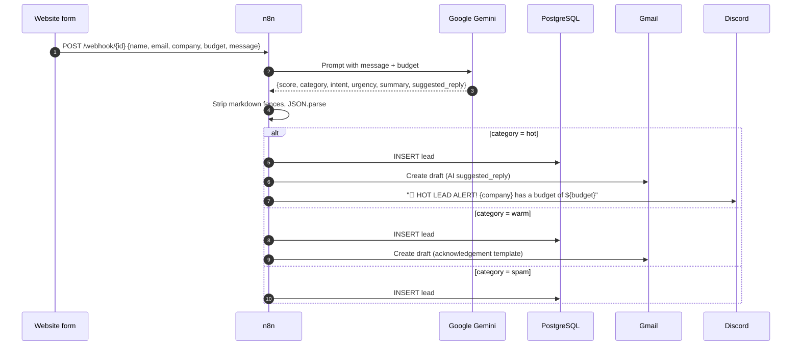
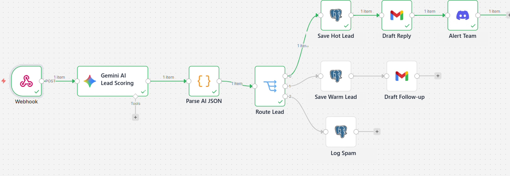

# AI Lead Qualification & Routing — n8n + Google Gemini



An n8n workflow that reads every inbound contact-form lead with Google Gemini, scores it, and routes it automatically:

- **Hot leads** are saved to the CRM table, get a personalized reply drafted in Gmail, and trigger an instant Discord alert to the sales team.
- **Warm leads** are saved and get a polite acknowledgement draft for follow-up.
- **Spam** is logged and never reaches anyone's inbox.

Replies are created as **Gmail drafts, not sent**, so a human stays in the loop and approves every message.

▶ **Demo video:** [`demo-video-portfolio.mp4`](demo-video-portfolio.mp4) (51 s)

---

## The problem

Contact forms dump every inquiry into the same inbox. A $25K enterprise project sits next to a crypto spam message, and by the time someone reads it, the lead has already talked to a competitor.

## The solution

| Step | What happens | Tool |
|---|---|---|
| 1. Capture | The website form POSTs the lead to an n8n webhook | n8n Webhook |
| 2. Analyze | Gemini reads the message and budget and returns structured JSON: score, category, intent, urgency, summary, suggested reply | Google Gemini |
| 3. Sanitize | A JavaScript parser strips markdown fences and extracts the JSON, so a chatty LLM response never breaks the pipeline | n8n Code node |
| 4. Route | A Switch node sends the lead down the `hot`, `warm` or `spam` branch | n8n Switch |
| 5. Act | Each branch logs the lead to PostgreSQL; hot and warm leads get Gmail drafts; hot leads also alert the team on Discord | PostgreSQL, Gmail, Discord |

---

## Architecture



### Request lifecycle



### The workflow in n8n



---

## AI output contract

Gemini is instructed to return **only** this JSON object:

```json
{
  "score": 9,
  "category": "hot",
  "intent": "Full-stack migration needed",
  "urgency": "high",
  "summary": "The lead needs an experienced full-stack engineer immediately to migrate a legacy HR portal to Angular and .NET Core by Q4 with a $25,000 budget.",
  "suggested_reply": "Hi there, I saw your urgent need for a full-stack engineer to lead the migration of your HR portal..."
}
```

| Field | Type | Values |
|---|---|---|
| `score` | integer | 1–10 |
| `category` | string | `hot` · `warm` · `spam` |
| `intent` | string | 3 words max |
| `urgency` | string | `high` · `medium` · `low` |
| `summary` | string | one sentence |
| `suggested_reply` | string | draft email body |

LLMs sometimes wrap JSON in markdown fences even when told not to. The Code node handles that defensively: it reads the text from Gemini's nested `content.parts[0].text`, falls back to `text`/`output`/`message`/`response`, strips the fences, then parses.

---

## Setup

### Prerequisites

- n8n (self-hosted or cloud)
- A Google Gemini API key
- PostgreSQL
- A Gmail account (OAuth2 credential in n8n)
- A Discord channel webhook URL

### 1. Create the database table

```sql
CREATE TABLE public.leads (
    id          SERIAL PRIMARY KEY,
    name        TEXT,
    email       TEXT,
    company     TEXT,
    score       INTEGER,
    category    TEXT,
    intent      TEXT,
    summary     TEXT,
    created_at  TIMESTAMPTZ DEFAULT now()
);
```

### 2. Import the workflow

1. In n8n, go to **Workflows → Import from File** and select [`AI Lead Qualification.json`](AI%20Lead%20Qualification.json).
2. Attach your own credentials to these nodes:
   - **Gemini AI Lead Scoring**: Google Gemini API
   - **Save Hot Lead**, **Save Warm Lead**, **Log Spam**: Postgres
   - **Draft Reply**, **Draft Follow-up**: Gmail OAuth2
   - **Alert Team**: Discord webhook
3. Activate the workflow and copy the **Production URL** from the Webhook node.

### 3. Connect the form

Open [`AI Lead Qualification.html`](AI%20Lead%20Qualification.html) and set `webhookUrl` to your production webhook URL:

```js
const webhookUrl = 'https://your-n8n-host/webhook/<your-webhook-id>';
```

Open the file in a browser and submit a lead.

### 4. Or test with curl

```bash
curl -X POST https://your-n8n-host/webhook/<your-webhook-id> \
  -H "Content-Type: application/json" \
  -d '{
        "name": "David",
        "email": "david@apex-financial.com",
        "company": "Apex Financial",
        "budget": "25000",
        "message": "We are looking to migrate our legacy HR management portal to a modern Angular frontend with a .NET Core backend. Strict Q4 deadline, need an experienced full-stack engineer to start immediately."
      }'
```

Expected result: a new `hot` row in `leads`, a Gmail draft addressed to the lead, and a Discord alert.

---

## Customization ideas

- **Swap the destination:** replace PostgreSQL with HubSpot, Pipedrive, Airtable or Google Sheets, and Discord with Slack or Microsoft Teams.
- **Tune the qualification rules:** edit the Gemini prompt to match your ideal customer profile, minimum budget or services.
- **Auto-send for warm leads:** switch the warm-branch Gmail node from *draft* to *send* once you trust the template.
- **Enrichment:** add a Clearbit or Apollo lookup before scoring to factor in company size and industry.

## Production hardening (roadmap)

- Add an **Error Trigger** workflow that notifies the team if Gemini returns invalid JSON.
- Add a **fallback route** in the Switch for unexpected categories.
- Validate and rate-limit the webhook (e.g. a header secret or a CAPTCHA on the form).
- Deduplicate repeat submissions by email.

---

## Tech stack

**n8n** · **Google Gemini** (`gemini-3.5-flash-lite`) · **PostgreSQL** · **Gmail API** · **Discord Webhooks** · **JavaScript** · **HTML**

## Project files

| File | Description |
|---|---|
| `AI Lead Qualification.json` | n8n workflow export (credential references only, no secrets) |
| `AI Lead Qualification.html` | Demo contact form that posts to the webhook |
| `demo-video-portfolio.mp4` | 51-second narrated demo |
| `assets/` | Thumbnails and workflow screenshot |

---

### Need something similar?

I build AI-powered automations with n8n, LLMs and your existing tools. Reach out to me.
